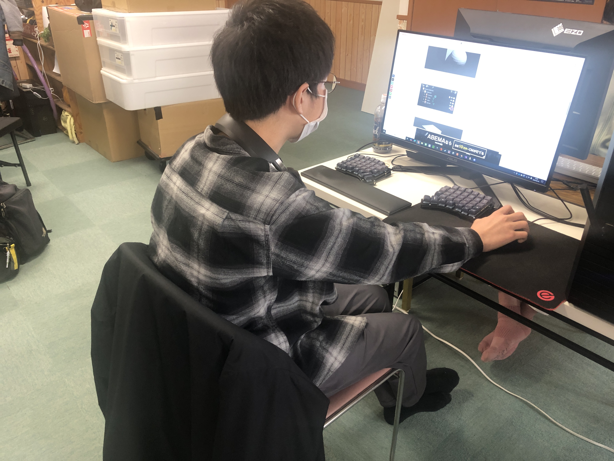
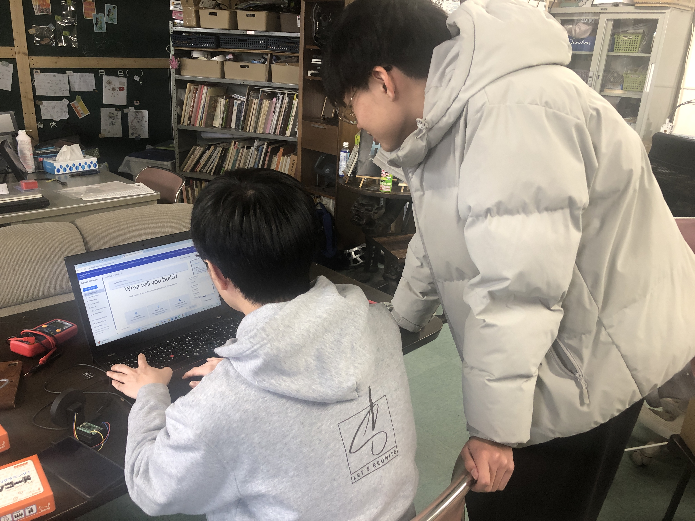

+++
title = "【開催のようす】第113(Re.)回 2025年3月30日コーダー道場恵庭"
date = 2025-03-30
template = "blog.html"

[extra]
author = "工藤崇史（チャンピオン）"
thumbnail = "IMG_6993.JPG"
+++
## 参加者
“Ninja2名、メンター2名”
中学1年生1名、小学4年生1名が参加してくれました。

## メンターもモノづくり
メンターの左側にある黒い物体は、3Dプリンタで出力したコントローラです。
ハンドルのように動き、ゲーム中の移動スピードを調節することができます。

## 謝辞
CoderDono恵庭は、NOVAS様の事業所の一部をお借りして実施しています。
いつもご協力ありがとうございます。

最後までお読みいただき、ありがとうございます。
次回は、4月28日（日）第114(Re.)回開催を予定しています。
よろしくお願いします。