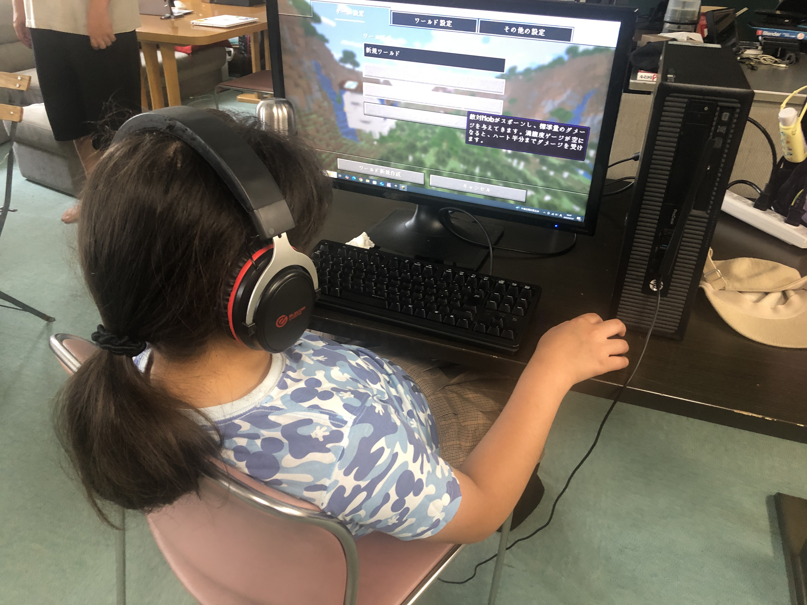
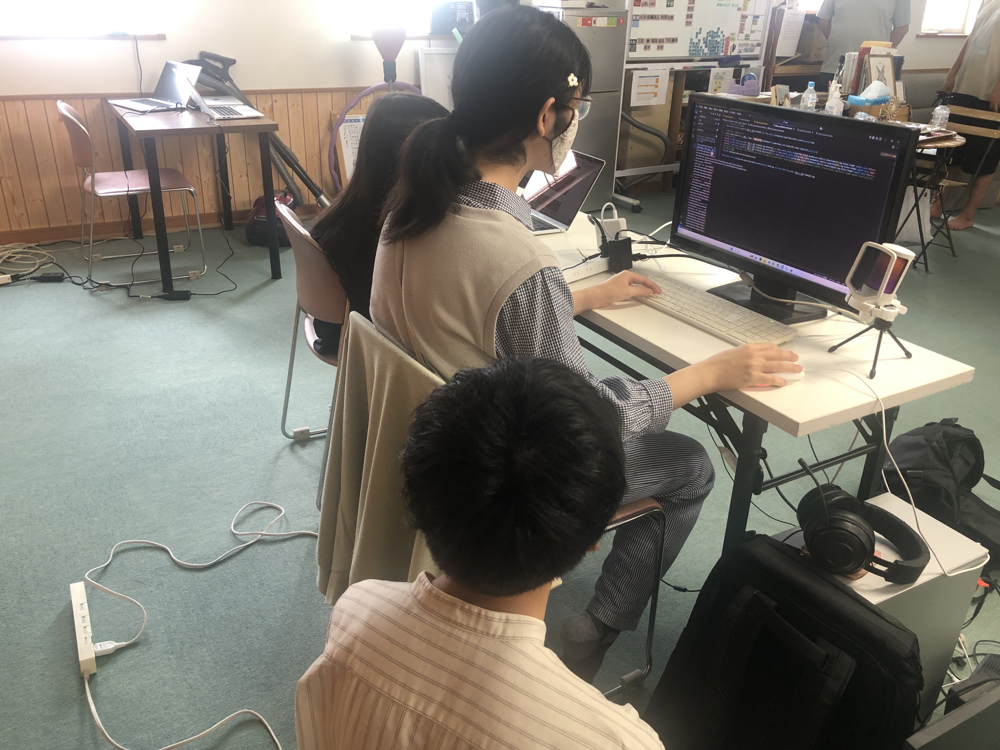
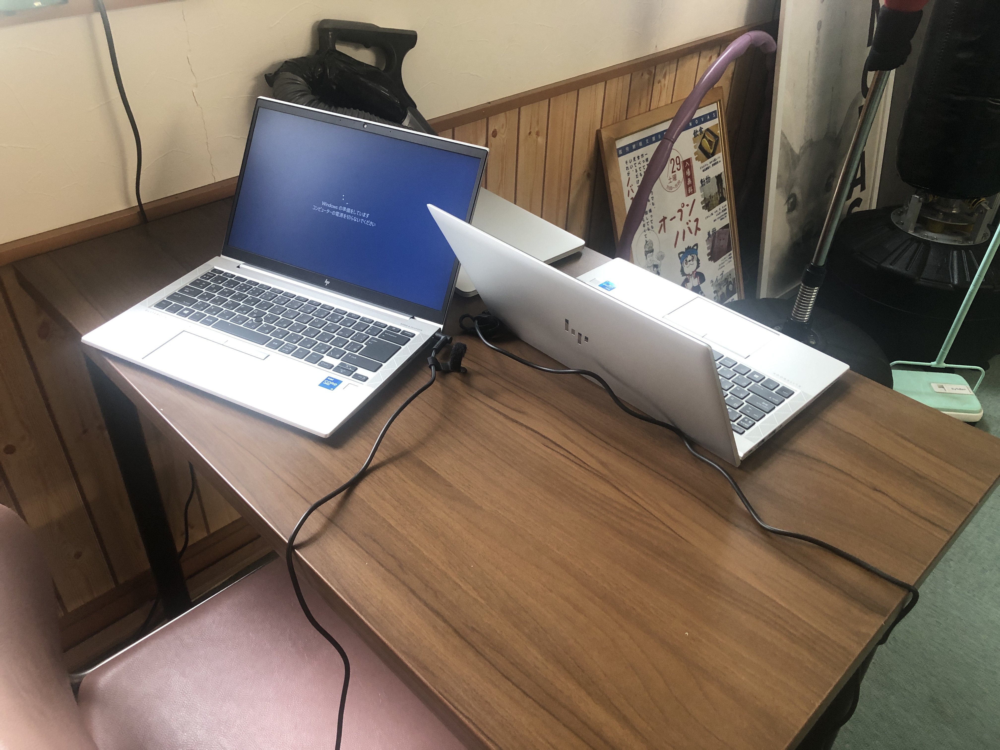
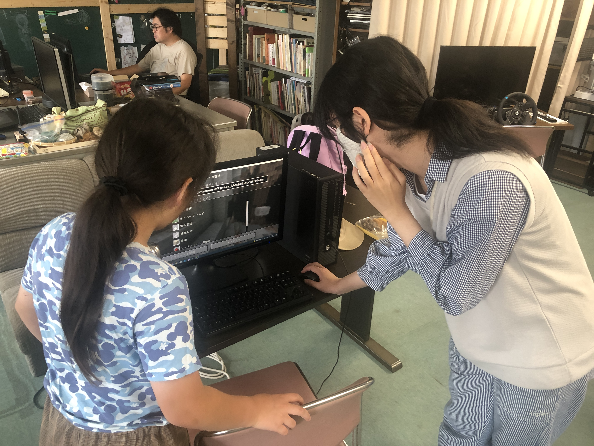
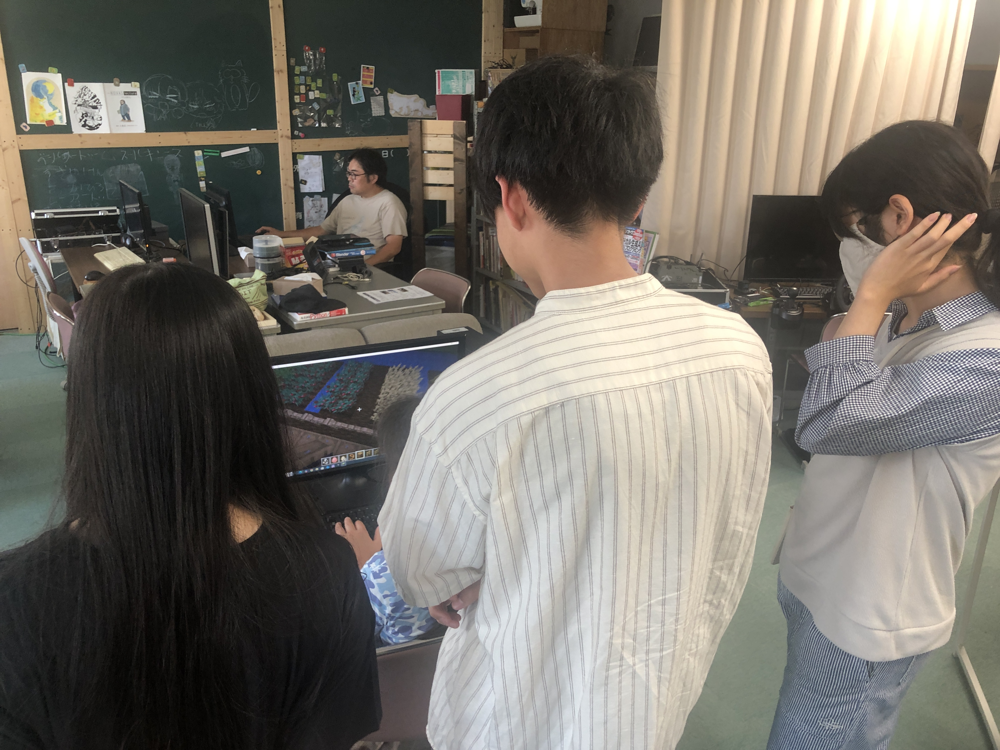
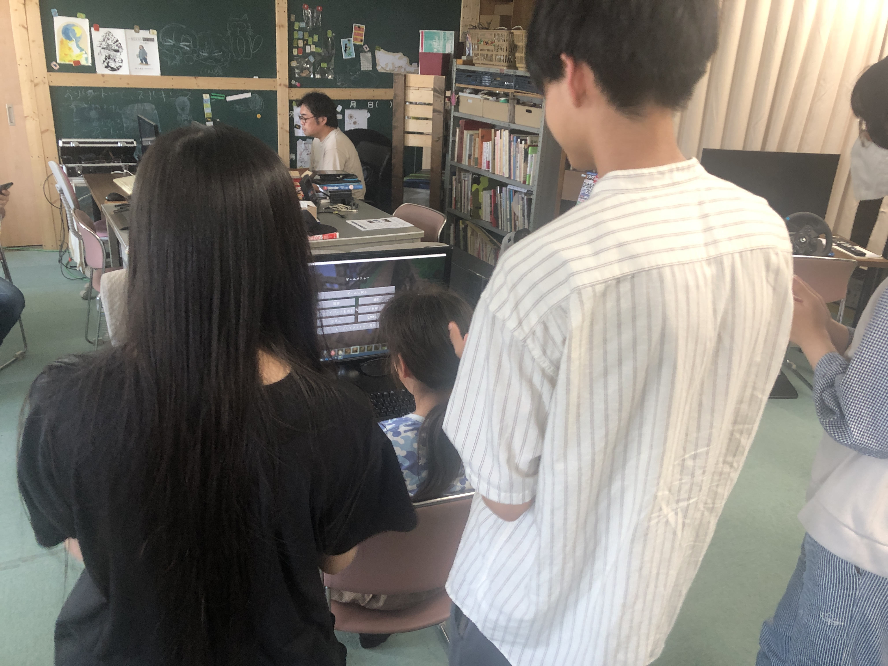

+++
title = "【開催のようす】第117(Re.)回 2025年7月27日コーダー道場恵庭"
date = 2025-07-27
template = "blog.html"

[extra]
author = "工藤崇史（チャンピオン）"
thumbnail = "IMG_7564.JPG"
+++
## 参加者
“Ninja1名、メンター3名”
小学校4年生1名が参加してくれました。

マイクラでいろいろなものを建築しています。

## 久しぶりの参加
海外留学しているメンターが、偶然にも帰国していたため、参加してくれました！
久しぶりに会う仲間で盛り上がります。

## 某アメリカ大手IT企業から寄贈いただいたPCをセットアップしています。
CoderDono恵庭には、計6台のPCを寄贈いただきました。ありがとうございます！

## 開催中の様子
Ninjaの質問に答える凄腕メンターです

## 発表の時間
参加したNinjaが今日やったことを発表してくれています。

## 謝辞
CoderDono恵庭は、NOVAS様の事業所の一部をお借りして実施しています。
いつもご協力ありがとうございます。

最後までお読みいただき、ありがとうございます。
次回は、8月31日（日）第118(Re.)回開催を予定しています。
よろしくお願いします。