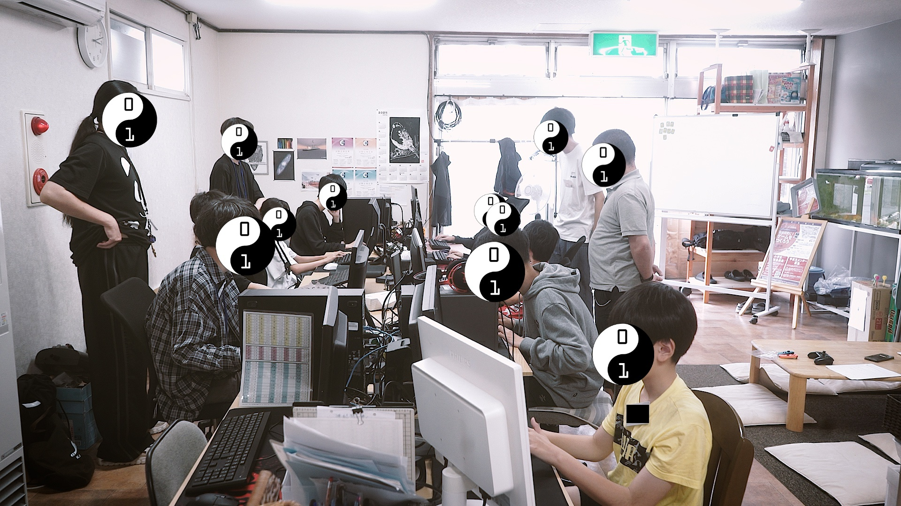
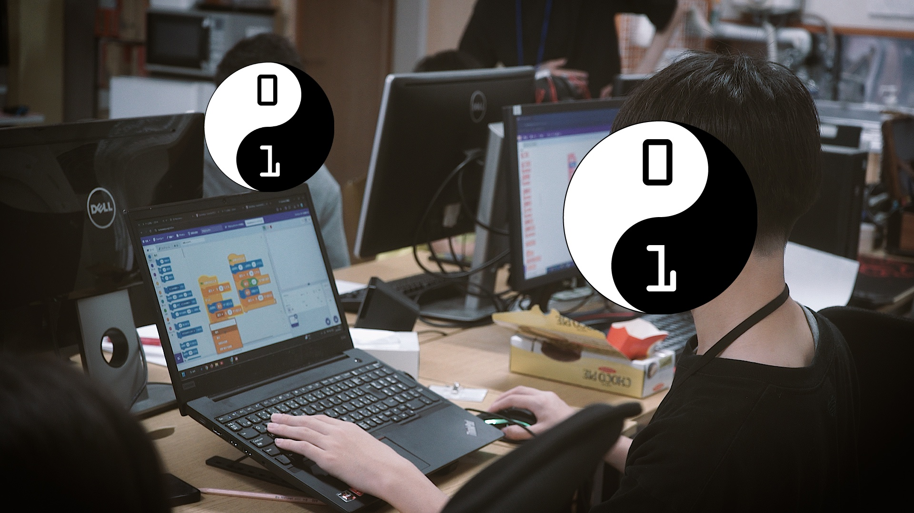
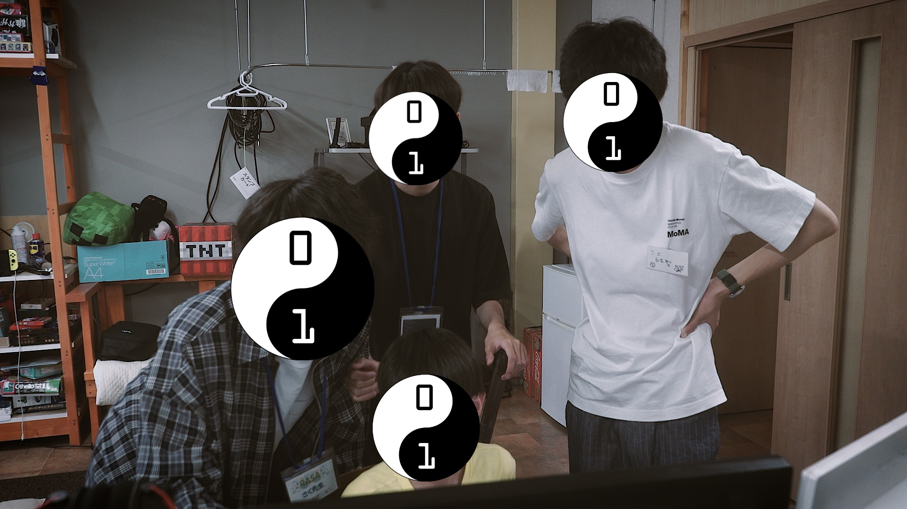

+++
title = "【開催のようす】夏休み特別企画Day1"
date = 2026-08-01
template = "blog.html"

[extra]
author = "三上皓聖"
thumbnail = "photo2.jpg"
+++

CoderDojoEniwa 夏休み特別企画「夏休みの自由研究にゲームを作ろう」の一日目を開催しました！

いつもCoderDojoEniwaの開催場所としてNOVASの場所をお貸しいただいている野村さんのツテで、同じく野村さんが運営している
千歳の放課後等デイサービス、RASAの場所をお借りして開催させていただきました。広報にご協力頂いた「生活情報誌 ちゃんと」様にも併せて、
この場を借りてお礼申し上げます。

さて、今回の応募者はもともと4人で締め切るつもりでしたが、思ったよりも好評をいただきまして、急遽枠を拡大しての5人に加え、
RASAの参加者からの飛び入り参加もありまして、冗談で言ったはずの「いっぱいのお運びで、誠に御礼申し上げます」があながち冗談にならないくらいの人数での開催となりました。
それでもRASAの高校生クルーの皆様にも厚い協力をいただきまして、おおむねオペレーションは回っていたかなという印象です。

さて、逆に反省点ですが、「ミニ良いこと」「デカ良いこと」という表現がいまいち伝わっていなかったように思います。たとえばスーパーマリオブラザーズで言ったら「右に進む」、スプラトゥーンなら「インクを塗る」などの
ゲームの中で推奨されている小さな行動を「ミニ良いこと」、スーパーマリオブラザーズで言えばゴールに辿り着く、スプラトゥーンなら相手より広いエリアを塗った状態で試合を終えるなどの、ゲーム内で提示され、それに向かって
「ミニ良いこと」を蓄積する目標のようなものを「デカ良いこと」としたのですが、やっぱり表現が分かりづらかったようです。

八月とは思えぬ涼しさはまだ数日続くそうです。ご自愛ください。
