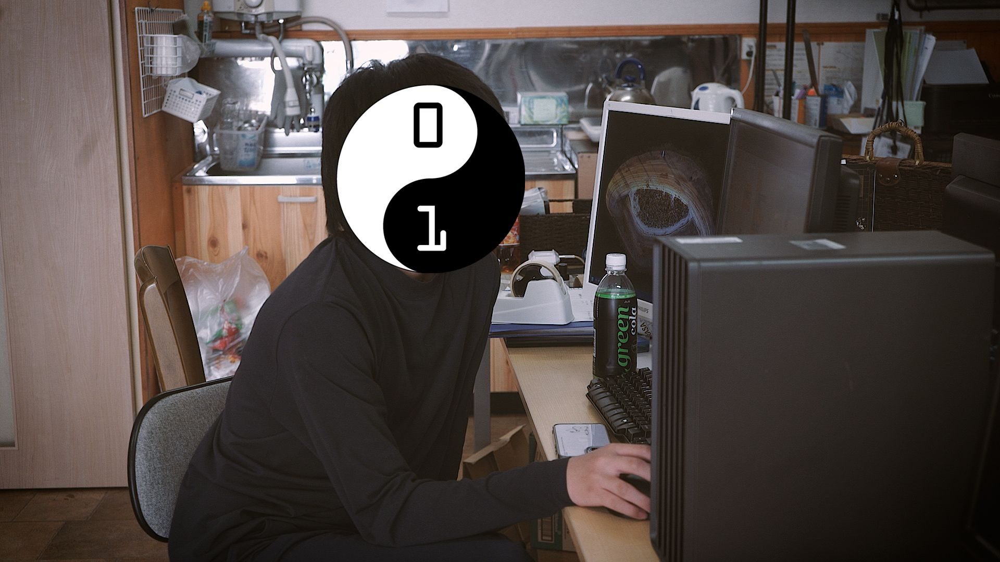
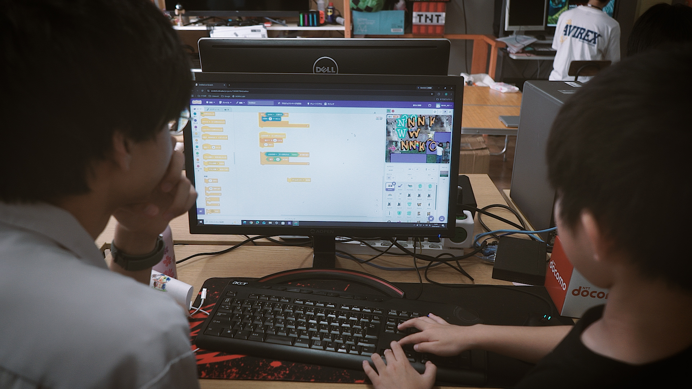
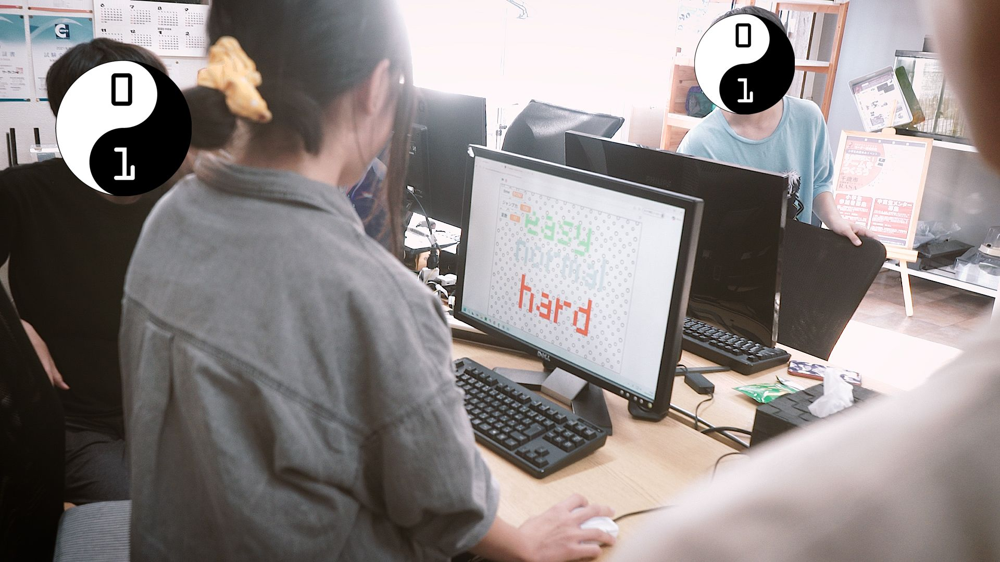
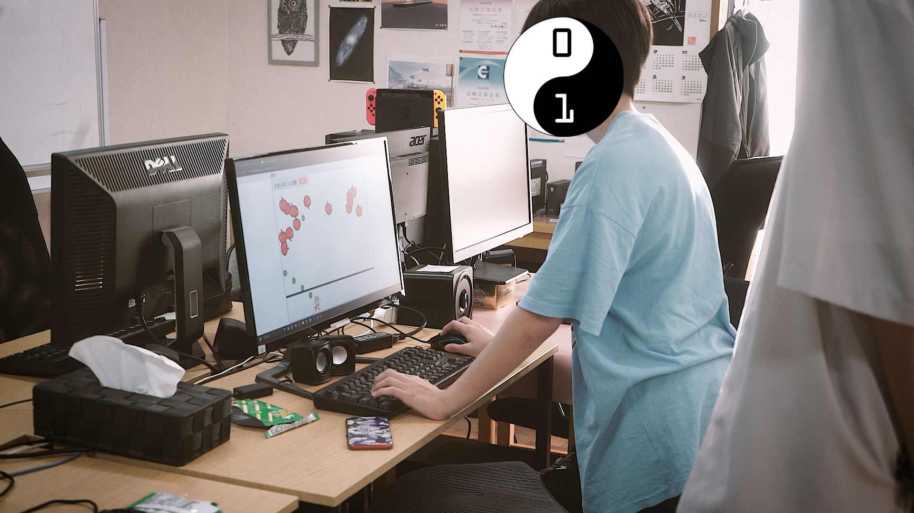

+++
title = "【開催のようす】夏休み特別企画Day2"
date = 2026-08-03
template = "blog.html"

[extra]
author = "三上皓聖"
thumbnail = "photo2.jpg"
+++

CoderDojoEniwa 夏休み特別企画「夏休みの自由研究にゲームを作ろう」の二日目を開催しました！

本日も千歳の放課後等デイサービス、RASAの場所をお借りして開催させていただきました。
今日からはもう一人飛び入りで参加者が増え、今日もなかなかの盛り上がりです。

リンゴを撃ち落とすゲームで爆弾も降ってくるようにしたり（保存を忘れてしまったようでこのコードは散逸してしまいました。無念）、
いままではただの装飾だった、箒に乗った謎ポーズの人が突っ込んできて触れたらゲームオーバーになったり（！？）、
だんだんゲームとしてのギミックが増えてきました。岩が転がってくるのをジャンプで避けるゲームを作っている子もメニュー画面を実装してくれたり、
みんな各自順調に進めてくれています。

また、普段からCoderDojo Eniwaに来てくれている子も来てくれていて、隣の子が困ったときにヘルプを出してくれています。
人数的に私だけでは対応しきれない場面も多くありますから、RASAの高校生クルーの方のお手伝いと併せて助かっています。

雨が多かった七月から一転、しばらくは晴れる予報だそうです。夏休みらしい天気ではありますが、熱中症には気をつけてお過ごしください。
