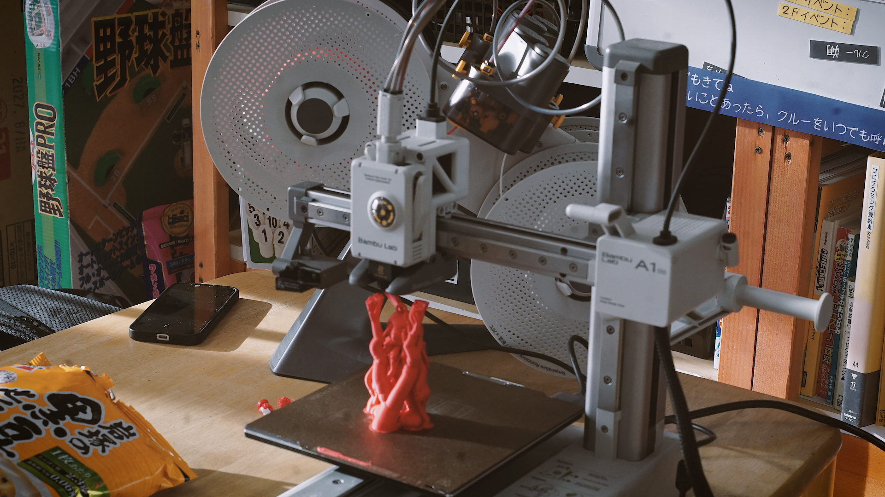
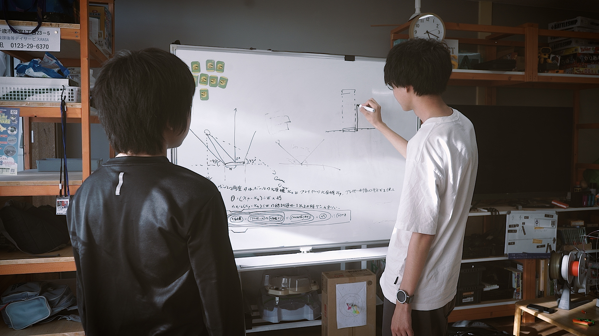
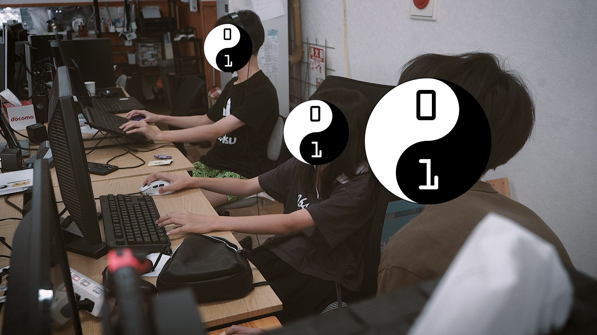

+++
title = "【開催のようす】夏休み特別企画Day4"
date = 2026-08-05
template = "blog.html"

[extra]
author = "三上皓聖"
thumbnail = "photo1.jpg"
+++

CoderDojoEniwa 夏休み特別企画「夏休みの自由研究にゲームを作ろう」の四日目を開催しました！
本日も千歳の放課後等デイサービス、RASAの場所をお借りして開催させていただきました。

今日は初日に来て、それからしばらく来れなかった子が久しぶりに来てくれました。若干作業がゆっくりな子なので
完成するか心配ですが、締め切り直前になると筆（今回の場合はキーボードとマウスですが）が自分でも信じられないほど進むのが
学生の性。今回はそれに賭けましょう。

さて、今回は参加者や私、高校生クルーのほかにも同時並行で頑張っていたのが一台。一人Claudeに作ってもらった自作エンジンで
3Dのホラーゲームを作っている子がいるのですが、そのホラーゲームに出てくるキャラクターを3Dプリンターで印刷していました。

アーキテクチャを説明してもらったのですが、ブラウザベースの特化型3D版RPGツクールみたいな感じでなかなか面白い……

参加者の中にもちらほら一個目が完成してしまったので二個目を作り始める子が。上の写真はいわゆる音ゲーのロングノーツの挙動を
ルールに分解しているところです。ちなみに、右に写っているストレートネックのウドの大木が私です。写真写りのまあなんと悪いこと。

そういえば私、あまりテーブルの奥側のほうに座っている子とはあんまり関わりがなくて寂しいですね。
これも高校生クルーの方が対応してくださっているからなので贅沢な悩みなのですが。私一人では手が回りませんから、いつも助かっています。

だんだんと結びの文句も思いつかなくなってきました。では、これで。
