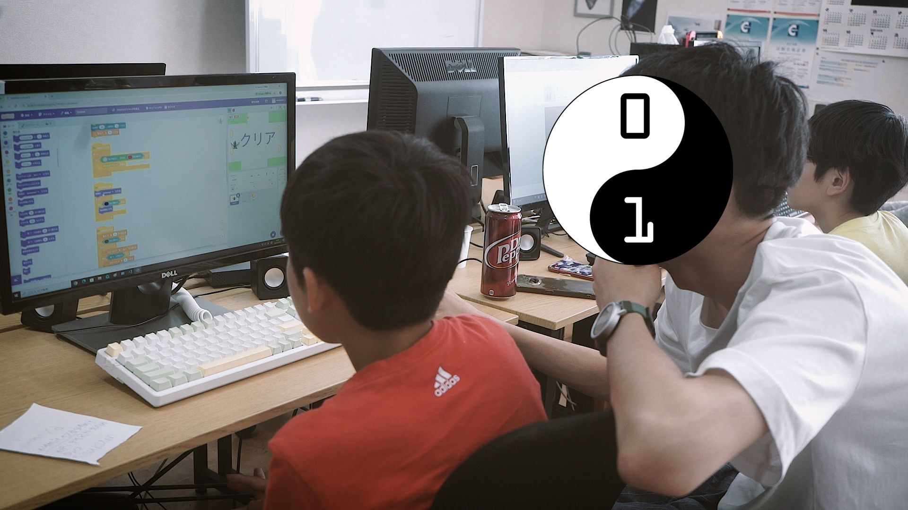
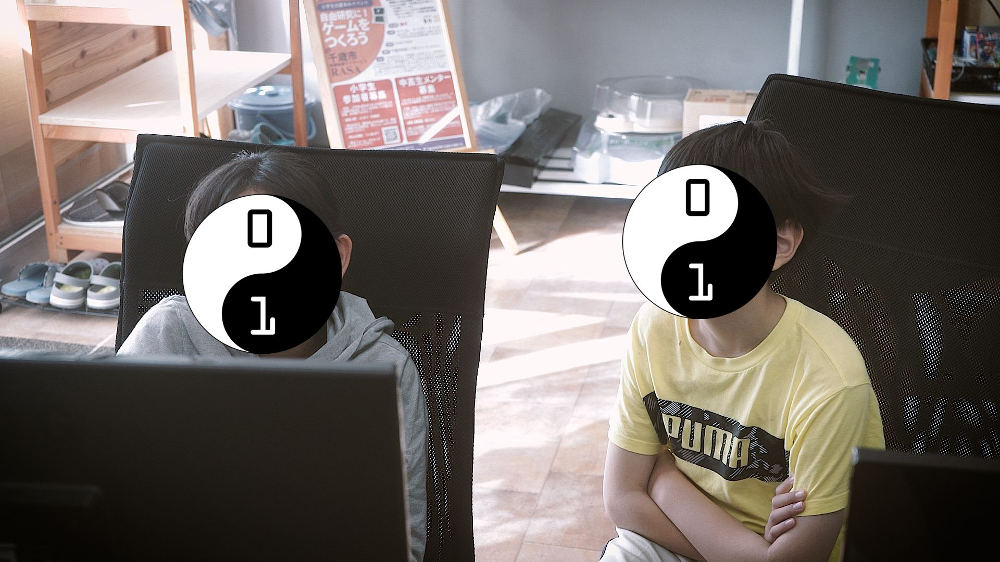
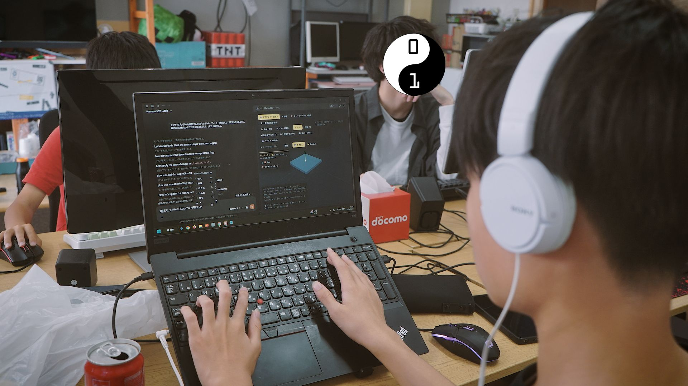

+++
title = "【開催のようす】夏休み特別企画Day5"
date = 2026-08-06
template = "blog.html"

[extra]
author = "三上皓聖"
thumbnail = "photo1.jpg"
+++

CoderDojoEniwa 夏休み特別企画「夏休みの自由研究にゲームを作ろう」の五日目を開催しました！
本日も千歳の放課後等デイサービス、RASAの場所をお借りして開催させていただきました。

これは雑談なのですが、そろそろ発表のための方法をしっかり考えねばな、と思い、昨日作ったScratchの
プログラミングブロックの塊を、スプライトごとに画像として書き出してくれるプログラミングとにらめっこして
ウンウン言っていたところ、何もPDFで作る必要がないことに気が付きました。

土に来れなくなった子もいるようですし、完成品のScratchプロジェクトのブロックを全部印刷して子供に渡し、
コラージュの要領で作ってもらうのが、家にパソコンがない子だったり、プリンターがない子でもできるいちばん
簡単な方法かな〜、と。コンピュータの世界に生きているとこういう解決法を見逃しがちです。

そういえば、前回でも書いたホラーゲームを作っている子のClaudeの料金はどこから出ているんだ……？と思って
聞いてみると、前にイベントに自作のカードゲームを出展してそれで8000円ほど稼いでいるらしいです。
私なんて18にもなってまだびた銭一文稼いだことないのに……

前回に引き続き略式で結びます。では、これで。
